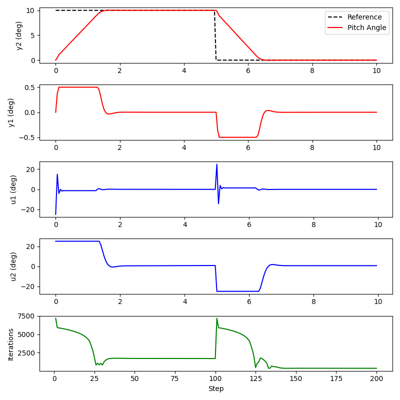

A Python port of [PiMPC](https://github.com/shaoanlu/PiMPC-python).

## Installation
Clone this repository
```bash
git clone https://github.com/shaoanlu/PiMPC-python.git
```
And install in edit mode
```bash
pip install -e .
```

## Usage
Refer to [examples](examples/)



## Testing